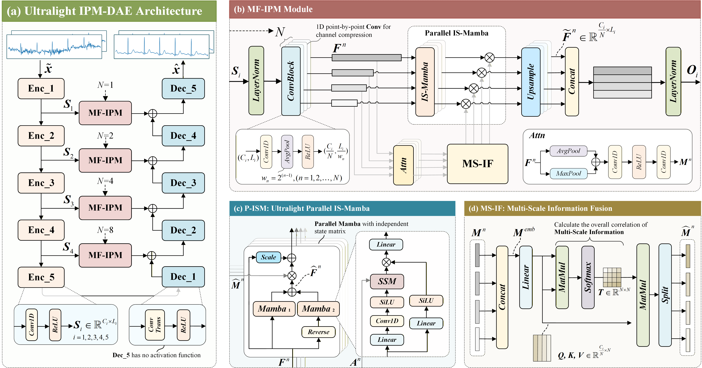

# Ultralight IPM-DAE
**An Ultra-Lightweight ECG Denoising Autoencoder via Parallel Mamba and Multi-Scale Fusion**

## Abstract
Electrocardiogram (ECG) is an important tool for diagnosing cardiovascular diseases. Clinically acquired ECG signals are often contaminated by various types of noise, severely impairing subsequent analysis. However, traditional methods are limited in denoising long-term complex ECG signals and often struggle to balance performance and efficiency. Therefore, we propose an ultra-lightweight denoising autoencoder (Ultralight IPM-DAE) for efficiently removing mixed noise in ECG signals. Specifically, Ultralight IPM-DAE integrates a parallel Mamba based on independent state matrices and a multi-scale information fusion module. The former is used to enhance the model’s ability to capture long-range dependencies in ECG signals, while the latter facilitates the integration and complementation of multi-scale information for more comprehensive feature representation. Experimental results demonstrate that Ultralight IPM-DAE achieves superior denoising performance with lower computational complexity, indicating higher clinical acceptability and validating the potential of Mamba as an ultra-lightweight backbone for electrophysiological signal analysis.

## Overview

## Getting Started

### Dataset Preparation

Download [QTDB](https://physionet.org/content/qtdb/1.0.0/) and [NSTDB](https://physionet.org/content/nstdb/1.0.0/) datasets and structure the files as follows:
<pre>
/datasets/qt-database-1.0.0
/datasets/mit-bih-noise-stress-test-database-1.0.0
</pre>

Load and visualize datasets as follows:
<pre>
python -m tools.load_qtdb
python -m tools.load_nstdb
</pre>

### Model Training
Train Ultralight IPM-DAE based on default settings:

<pre>
python -m main --use_model='Ultralight_IPM_DAE'
</pre>

Test model:

<pre>
python -m test --use_model="Ultralight_IPM_DAE" --version=0
</pre>
